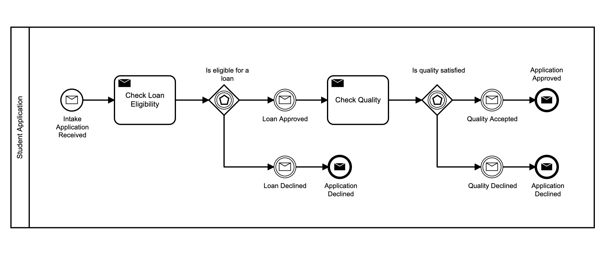
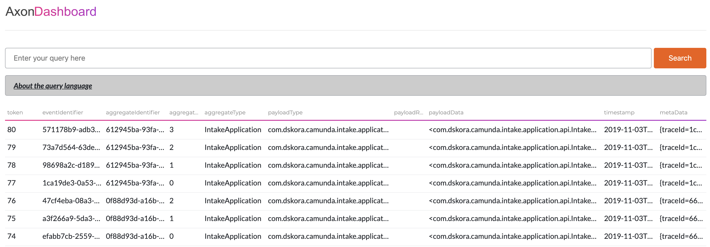

# Camunda Axon example
This is a sample application with the purpose of showing the capabilities of Axon Framework and Camunda BPM tool.

This example shows:

- How to run a Camunda BPMN workflow with Axon Framework.

== Run docker containers via docker compose

[source,bash]
----
mvn clean install
docker-compose up -d
----

== Camunda Platform
Camunda BPM is an open-source workflow and decision automation platform. It provides a BPMN standard compliant workflow engine and a DMN standard compliant decision engine, which can be embedded in Java applications and with other languages via REST.

Simple intake application example workflow

== Axon Framework
Axon Framework is a Java framework that provides implementations of the most important building blocks, e.g. aggregates, command and event buses, as well as repositories to help developers apply the CQRS architectural pattern when building applications.

== Demo Data

[source,bash]
----
curl -X POST localhost:8102/intake-application -d "firstname=daniel&surname=skora"
curl -X POST localhost:8102/intake-application -d "firstname=tom&surname=lush"
curl -X POST localhost:8102/intake-application -d "firstname=adam&surname=lewis"
----

== Axon Server Events -
Display a list of an events - http://localhost:8024

== See Results
Login to camunda - http://localhost:8080 (demo:demo).

List history data
[source,bash]
----
curl http://localhost:8080/api/engine/engine/default/history/process-instance
----

